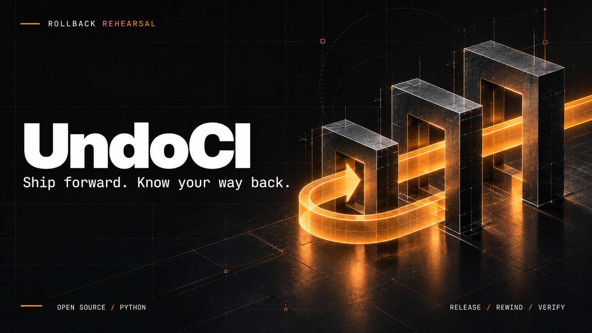
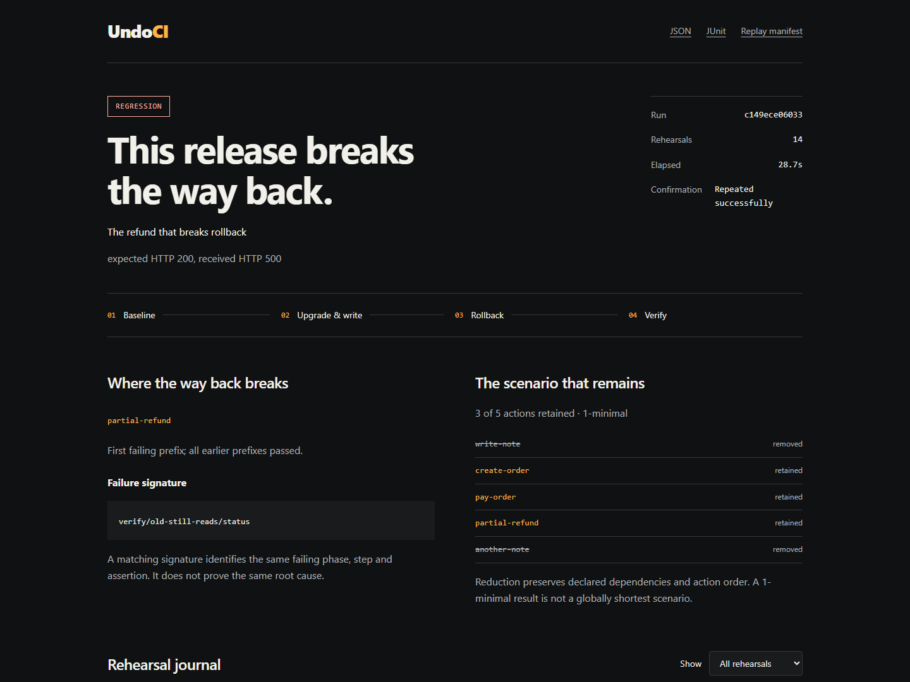

<p align="center"></p>

<p align="center"><strong>Найди операцию, после которой откат перестаёт работать. До релиза.</strong></p>

<p align="center"><a href="README.md">English</a> · <a href="docs/configuration.md">Настройка</a> · <a href="docs/architecture.md">Архитектура</a></p>

## Релиз прошёл. А откат?

Новая версия успешно запускается, проходит тесты и начинает записывать данные. Затем
приходится откатиться. Старый контейнер жив, `/health` отвечает — а список заказов падает,
потому что новая версия записала неизвестный старому коду статус.

**UndoCI проверяет именно этот момент.** Он запускает старую версию, устанавливает новую,
выполняет пользовательские действия, возвращает старый код **с сохранением новых данных**
и проверяет заданные условия. При ошибке ищет первый опасный префикс действий и сокращает
сценарий до небольшого воспроизводимого примера.

```text
Старая версия → Новая версия → Действия пользователя → Откат → Проверки
               Код меняется. Состояние сохраняется.
```

## Запусти первую репетицию

Python 3.11+. Для локальных демонстраций не нужны Docker, облако и API-ключи.
Установка из папки репозитория:

```powershell
python -m venv .venv
.\.venv\Scripts\python.exe -m pip install -e .
.\.venv\Scripts\undoci.exe demo refund-demo
.\.venv\Scripts\undoci.exe run refund-demo\undoci.yaml
```

На Linux/macOS активируй окружение через `source .venv/bin/activate` и используй `undoci`.

Ожидаемый результат демонстрации:

```text
REGRESSION
First failing prefix ends at: partial-refund
Retained actions: create-order, pay-order, partial-refund
```

Код завершения `1` ожидаем: демонстрационный релиз специально сломан. Две посторонние
операции удаляются из сценария, а создание, оплата и частичный возврат остаются.

Открой `report.html` по пути, который напечатала команда. Рядом лежат JSON, JUnit XML,
Markdown-резюме и `replay.json` для повторного запуска:

```bash
undoci replay .undoci/<run-id>/replay.json
```

<p align="center"></p>

## Что уже реализовано

- Полный цикл old → new → old с сохранением состояния внутри репетиции.
- Запуск локальных процессов и Docker Compose с отдельным проектом на каждый прогон.
- Команды подготовки, миграции вперёд, отката и очистки.
- HTTP-проверки статуса и JSON Pointer, захват значений из ответов.
- Автоматические зависимости по захваченным значениям и явные `depends_on`.
- Последовательный поиск первой опасной операции, без предположения о монотонности ошибок.
- Сокращение сценария с проверкой той же сигнатуры сбоя.
- Повторные прогоны для подтверждения; отдельный результат для нестабильных ошибок.
- Автономный HTML-отчёт с фильтром и подробностями каждого прогона.
- CLI, JSON Schema, машиночитаемые результаты и CI workflow.

## Четыре готовых сценария

| Сценарий | Команда создания | Что проверяет |
|---|---|---|
| `enum` | `undoci demo demo-enum --scenario enum` | Старый код не понимает новый статус |
| `queue` | `undoci demo demo-queue --scenario queue` | Старый worker не читает новый формат задания |
| `data-loss` | `undoci demo demo-loss --scenario data-loss` | Откат портит исходные данные даже без новых действий |
| `safe` | `undoci demo demo-safe --scenario safe` | Совместимый reader успешно проходит откат |

После создания: `undoci run <папка>/undoci.yaml`. Локальные демо используют SQLite;
очередь представлена таблицей заданий. Отдельный [пример PostgreSQL](examples/postgres/README.md)
работает с двумя Docker-образами и настоящим сервером PostgreSQL.

## Подключение своего приложения

Опиши в YAML команды запуска старой и новой версии, workload и проверки. Локальные серверы
должны слушать `UNDOCI_PORT` и хранить тестовые данные в `UNDOCI_TRIAL_DIR`. Полный формат,
примеры hooks, Docker Compose и правила минимизации — в [справочнике](docs/configuration.md).

```bash
undoci validate undoci.yaml
undoci run undoci.yaml --max-trials 40
undoci run undoci.yaml --no-minimize
undoci doctor
```

Коды завершения: `0` — проверки пройдены, `1` — ошибка отката, `2` — ошибка настройки,
подготовки, workload или очистки, `3` — неподтверждённый результат, `130` — прерывание.

## Честные границы

Это ранний релиз с работающим сквозным циклом. UndoCI проверяет только описанные сценарии
и условия. Он не доказывает безопасность любых откатов и не исправляет приложение сам.

`1-minimal` означает, что проверенные удаления одиночных действий с зависимостями не
сохранили ошибку. Это не гарантия глобально кратчайшего сценария. Результат с исчерпанным
бюджетом помечается отдельно. Сигнатура идентифицирует упавшую проверку, а не доказывает
единственную первопричину.

Конфигурация запускает код с правами текущего пользователя. Используй изолированные
тестовые данные и заглушки внешних платежей, почты и других необратимых действий.
Подробнее — [SECURITY.md](SECURITY.md).

## Разработка

```bash
python -m pip install -e ".[dev]"
ruff check .
pytest -m "not docker"
python -m build
```

[MIT](LICENSE). Без телеметрии, обязательного облака и LLM-зависимостей.
